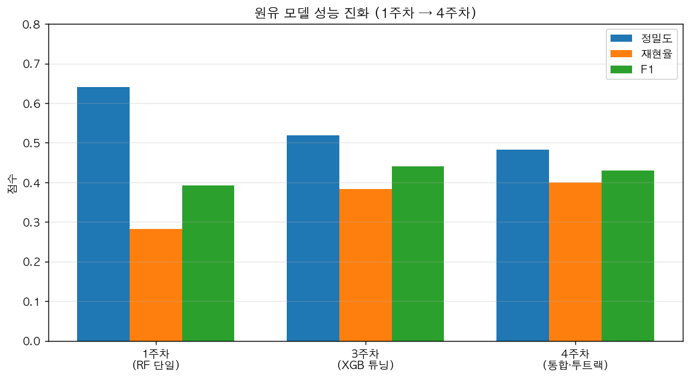
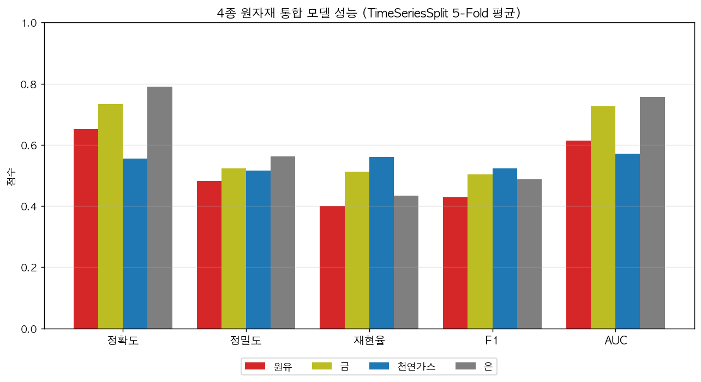
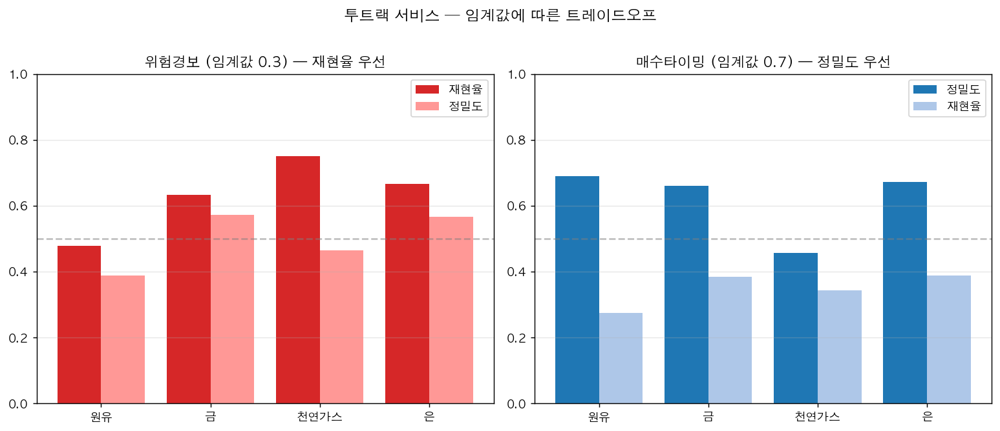

# 지정학적 리스크를 반영한 원자재 이상 변동 감지 및 가격 예측

전쟁·정치 불안 지수(**GPR**)와 시장 불안 지수(**VIX**)로 원자재 가격의 급변동을 사전 감지하는 머신러닝 프로젝트.
한 학기(4단계) 동안 베이스라인 모델의 한계를 단계적으로 해결해 **실제 서비스 형태의 데모**까지 완성했습니다.

**🔗 라이브 데모 — https://dbwhdgjs.github.io/ml-project/**

| 항목 | 내용 |
|------|------|
| 문제 유형 | 이진 분류 (이상변동 발생 여부) + 보조 회귀 (익일 수익률) |
| 데이터 | 원자재 4종 + VIX + GPR, 2020-01-02 ~ 2026-06-17 (1,627일) |
| 최종 모델 | XGBoost + SMOTE + TimeSeriesSplit 5-Fold, Feature 23개 |
| 핵심 성과 | 원유 Recall **28.3% → 40.0%**, 임계값 조정 시 경보 Recall 최대 **75.0%** |
| 서비스 설계 | 투트랙 — 위험경보(Recall 우선) / 매수타이밍(Precision 우선) |
| 기술 스택 | Python · scikit-learn · XGBoost · imbalanced-learn · pandas · yfinance · Streamlit · Chart.js · reportlab |

---

## 1. 문제 정의

원자재 가격의 급변동은 지정학적 사건(전쟁, 분쟁, 정책 충격)에 크게 반응합니다.
"**내일 이 원자재에 이상 변동이 일어날 것인가**"를 예측 대상으로 설정하고, 자재별 변동성 특성에 맞춰 이상변동 기준을 달리 정의했습니다.

| 원자재 | 이상변동 기준 (일일 수익률) | 이상변동 비율 |
|--------|------------------------|--------------|
| 원유(WTI) | \|수익률\| ≥ 2.0% | 35.6% |
| 금 | \|수익률\| ≥ 1.0% | 29.1% |
| 천연가스 | \|수익률\| ≥ 3.0% | 46.4% |
| 은 | \|수익률\| ≥ 2.0% | 26.5% |

## 2. 데이터

| 데이터 | 출처 | 수집 방법 |
|--------|------|-----------|
| 원유(WTI), 금, 천연가스, 은 | Yahoo Finance | `yfinance` (CL=F, GC=F, NG=F, SI=F) |
| VIX (변동성 지수) | CBOE | `yfinance` (^VIX) |
| GPR Index (지정학적 리스크) | Caldara & Iacoviello (FRB) | 공개 엑셀 자동 다운로드 |

- 통합 파일: `data/commodity_vix_gpr_data.xlsx` (학습 기준본, 1,558일) / `commodity_vix_gpr_latest.xlsx` (자동 갱신본, 1,627일)
- 변수 8개: 원자재 4종 종가 + VIX + GPR 3종(종합·실제행동·위협)

---

## 3. 발전 과정

프로젝트의 핵심은 **단계마다 드러난 한계를 다음 단계에서 해결한 기록**입니다.

| 단계 | 핵심 변경 | 원유 Recall | 남은 한계 |
|------|----------|-------------|-----------|
| **1주차** 베이스라인 | Random Forest, Feature 7개, Random Split | 28.3% | 시간순서 무시, 시차 미반영, 원유만 대상 |
| **2주차** 모델 비교 | TimeSeriesSplit 도입, 5종 모델 비교 | 24.3% (RF) | 현실적 검증으로 성능 하락 → Feature 부족 확인 |
| **3주차** 반복 수정 | Feature 7→23개, SMOTE, GridSearchCV | 38.4% (튜닝 XGB) | 원유 단일 자재, 고정 임계값 0.5 |
| **4주차** 적용 관점 | 4종 원자재 통합, 투트랙 임계값, 자동화·데모 | 40.0% / 경보 47.9% | AUC 0.57~0.76, 천연가스 난이도 |



### 1주차 — 베이스라인 구축
- **모델 A** (이상변동 감지, Random Forest): Accuracy 68.3% / Precision 64.0% / **Recall 28.3%** / F1 39.3%
- **모델 B** (가격 방향 예측): 방향 정확도 47.4% — 동전 던지기보다 낮음. 100만원 시뮬레이션에서 단순 보유(133만원)보다 손실(90만원)
- Feature 중요도 1위: VIX (0.216)
- 📄 [1주차 보고서](week1/reports/1주차_보고서.pdf)

> **솔직한 진단:** Accuracy 68.3%는 "전부 정상"으로 찍어도 64.5%가 나오는 데이터라 실질 기여가 거의 없었고, 실제 이상변동의 **72%를 놓치고** 있었습니다. 방향 예측은 실패로 판단해 이후 단계에서 이상변동 감지에 집중했습니다.

### 2주차 — 모델 확장 & 비교
- 1주차의 가장 큰 결함인 **Random Split → TimeSeriesSplit 5-Fold**로 교체 (미래 데이터 누수 제거)
- 5종 모델 비교 (원유, Feature 7개 기준)

| 모델 | Accuracy | Precision | Recall | F1 |
|------|----------|-----------|--------|-----|
| Random Forest | 0.649 | 0.449 | 0.243 | 0.304 |
| Logistic Regression | 0.673 | 0.416 | 0.149 | 0.209 |
| SVM | 0.659 | 0.423 | 0.200 | 0.268 |
| **XGBoost** | 0.623 | 0.408 | **0.320** | **0.352** |
| KNN | 0.598 | 0.377 | 0.311 | 0.337 |

- 📄 [2주차 보고서](week2/reports/2주차_보고서.pdf)

> 시간순 검증으로 바꾸자 점수가 전반적으로 떨어졌습니다. **성능이 낮아진 것이 아니라, 1주차 점수가 부풀려져 있었던 것**입니다. Recall이 가장 높은 XGBoost를 이후 주력 모델로 선택했습니다.

### 3주차 — 반복 수정 (Feature 엔지니어링 + 불균형 처리 + 튜닝)
- **Feature 7개 → 23개**: Lag(1·3·5일), 이동평균(MA5·MA20·MA ratio), 20일 변동성, RSI(14), VIX 파생
- **SMOTE**로 클래스 불균형 보정 (fold 내부에서만 적용해 누수 방지)
- **GridSearchCV** 튜닝 결과: `learning_rate=0.1, max_depth=6, n_estimators=200`
- 튜닝 XGBoost: Accuracy 0.723 / Precision 0.519 / **Recall 0.384** / F1 0.441 / ROC-AUC 0.648
- Feature 중요도 Top3: **20일 변동성(0.104)**, VIX 변동성(0.052), MA ratio(0.050)
- 📄 [3주차 보고서](week3/reports/3주차_보고서.pdf)

> 2주차 대비 Recall이 32.0% → 38.4%로 올랐습니다. 특히 **"변동성이 이미 커진 국면"**이 다음 이상변동의 가장 강한 신호라는 점이 Feature 중요도로 확인됐습니다.

### 4주차 — 적용 관점 (4종 통합 + 투트랙 + 자동화)
- 동일 파이프라인으로 **4종 원자재 동시 학습** + 자재 간 cross feature
- 고정 임계값 0.5를 버리고 **용도별 임계값**으로 분리 (아래 4·5절)
- 데이터 자동 수집 → 예측 JSON 생성 → GitHub Pages 배포까지 파이프라인 구성
- 📄 [4주차 보고서](week4/reports/4주차_보고서.pdf)

---

## 4. 최종 성능 (TimeSeriesSplit 5-Fold 평균)

| 원자재 | Accuracy | Precision | Recall | F1 | ROC-AUC |
|--------|----------|-----------|--------|-----|---------|
| 원유(WTI) | 0.652 | 0.482 | 0.400 | 0.430 | 0.613 |
| 금 | 0.734 | 0.523 | 0.512 | 0.504 | **0.726** |
| 천연가스 | 0.555 | 0.517 | 0.561 | 0.524 | 0.571 |
| 은 | **0.791** | **0.562** | 0.434 | 0.487 | 0.757 |



- **은·금**이 가장 예측 가능했고(AUC 0.73~0.76), **천연가스**는 이상변동 비율이 46%에 달할 만큼 변동 자체가 일상적이어서 가장 어려웠습니다.
- 모든 자재에서 4주차 모델이 1주차 베이스라인보다 Recall이 개선됐습니다.

## 5. 투트랙 서비스 설계

교수님 피드백(**제1종·제2종 오류**)과 행동경제학의 **손실회피 효과**를 근거로, 하나의 모델을 두 가지 서비스로 분리했습니다.

> 투자자에게 **FN(이상변동을 놓침)은 FP(허위 경보)보다 훨씬 치명적**입니다. 같은 금액이라도 손실이 이익보다 약 2배 크게 느껴지기 때문에, 놓치지 않는 것과 정확히 맞히는 것은 서로 다른 목표로 다뤄야 합니다.

| 트랙 | 임계값 | 목표 | 사용자 가치 |
|------|--------|------|-------------|
| 🛡 **위험 경보** | 확률 ≥ 0.30 | Recall 우선 | 작은 신호도 놓치지 않기 |
| 🎯 **매수 타이밍** | 확률 ≥ 0.70 | Precision 우선 | 확신이 높을 때만 추천 |

| 원자재 | 경보 Recall | 경보 Precision | 타이밍 Precision | 타이밍 Recall |
|--------|-------------|----------------|------------------|---------------|
| 원유(WTI) | 0.479 | 0.389 | **0.690** | 0.274 |
| 금 | 0.634 | 0.573 | 0.662 | 0.384 |
| 천연가스 | **0.750** | 0.466 | 0.457 | 0.343 |
| 은 | 0.667 | 0.566 | **0.673** | 0.389 |



기본 임계값 0.5에서 원유 Recall은 40.0%였지만, **경보 모드에서는 47.9%, 천연가스는 75.0%까지** 끌어올릴 수 있습니다. 반대로 타이밍 모드는 원유·은에서 Precision 약 69%를 확보합니다.

**B2C / B2B 구분**
- **B2C**: 개인 투자자 대상. UI/UX와 신뢰 형성이 핵심 → 데모 사이트는 ML 용어를 쓰지 않고 "놓치지 않은 비율", "맞힌 비율" 같은 일상 언어로 표현
- **B2B**: 원자재를 원가로 쓰는 기업 대상. 의사결정자 1명 설득이 핵심 → 데이터 품질·갱신 일관성·보고 관리 용이성 중시

## 6. 데모 (GitHub Pages)

**https://dbwhdgjs.github.io/ml-project/**

- `docs/` 폴더를 GitHub Pages로 서빙하는 **정적 사이트** (로그인·서버 없이 강의실·모바일에서 접속)
- 홈 → 자재별 상세(원유·금·천연가스·은) → 성능 지표 페이지 구성, 햄버거 메뉴로 이동
- 위험경보 / 매수타이밍 **모드 토글**, Chart.js 가격 추이 차트
- 모델 학습 결과는 `docs/predictions.json`으로 내보내고 프런트엔드가 읽어서 렌더링
- 로컬 Streamlit 버전: `week4/code/streamlit_app.py`, `week2/code/demo_app.py`

## 7. 자동화 파이프라인

```
yfinance + GPR 공개 엑셀
        │  week2/code/data_updater.py --update   (또는 week4/code/auto_update.py)
        ▼
data/commodity_vix_gpr_latest.xlsx
        │  docs/export_predictions.py           (XGBoost 재학습 → 4종 예측)
        ▼
docs/predictions.json
        │  git push                             (GitHub Pages 자동 배포)
        ▼
    라이브 데모 반영 (1~2분)
```

- `data_updater.py --watch`: KST 06~10시 사이 30분 간격으로 갱신 확인 후 성공 시 종료
- `data_updater.py --analyze`: 누적 로그(`data/update_log.json`)로 최적 갱신 시각 분석
- launchd / cron 등록 방법은 `week2/code/데이터_자동갱신_운영가이드.txt` 참고

---

## 8. 폴더 구조

```
ML_project/
├── data/                  원자재·VIX·GPR 통합 데이터 (xlsx) + 갱신 로그
├── week1/                 베이스라인 (Random Forest)
│   ├── code/              week1_model.py
│   ├── charts/            가격 추이·리스크·상관관계·혼동행렬·중요도 (6종)
│   └── reports/           1주차 보고서 (md, pdf) + PDF 생성 스크립트
├── week2/                 5종 모델 비교 + TimeSeriesSplit
│   ├── code/              week2_model.py, data_updater.py, demo_app.py
│   ├── charts/            모델 비교·ROC·혼동행렬·fold별 F1
│   └── reports/           2주차 보고서, 중간발표 자료
├── week3/                 Feature 23개 + SMOTE + GridSearchCV
│   ├── code/              week3_model.py
│   ├── charts/            2주차 대비 개선·Recall·중요도·ROC
│   └── reports/           3주차 보고서, results.json
├── week4/                 4종 원자재 + 투트랙 + 자동화
│   ├── code/              week4_model.py, auto_update.py, streamlit_app.py, make_charts.py
│   ├── charts/            4종 비교·투트랙·PR곡선·이상비율·진화비교
│   └── reports/           4주차 보고서, results.json, 기말 발표대본
└── docs/                  GitHub Pages 데모 (index.html, predictions.json, export_predictions.py)
```

## 9. 실행 방법

```bash
pip install -r requirements.txt
# 모델 학습에 추가로 필요: pip install yfinance xgboost imbalanced-learn matplotlib reportlab

# 주차별 모델 실행
python3 week1/code/week1_model.py      # 데이터 수집부터 (yfinance + GPR 다운로드)
python3 week2/code/week2_model.py      # 5종 모델 비교
python3 week3/code/week3_model.py      # Feature 엔지니어링 + SMOTE + 튜닝
python3 week4/code/week4_model.py      # 4종 원자재 + 투트랙 → results.json

# 데이터 갱신 → 데모 반영
python3 week2/code/data_updater.py --update
python3 docs/export_predictions.py
git add docs/predictions.json && git commit -m "Update predictions" && git push

# 로컬 대시보드
streamlit run week4/code/streamlit_app.py
```

> 차트·PDF는 한글 폰트가 필요합니다. macOS는 AppleGothic을 자동 탐색하며, 다른 환경에서는 저장소의 `AppleSDGothicNeo.ttf`를 사용하세요.

## 10. 한계 & 향후 개선

- **ROC-AUC 0.57~0.76**: 금·은은 실용 가능한 수준이지만 원유·천연가스는 여전히 약합니다. 일별 종가만으로는 사건의 타이밍을 포착하기 어렵습니다.
- **가격 방향 예측은 실패**로 남겨두었습니다(1주차 47.4%). 방향·수익률 예측은 데모에서 참고 정보로만 노출하고, 서비스의 축은 이상변동 감지로 한정했습니다.
- **GPR은 일별 갱신이 1~2일 지연**됩니다. 자동 갱신 스크립트에서 forward-fill 버전(`latest`)과 지연 반영 버전(`live`)을 나눠 관리했습니다.
- 개선 방향: 뉴스 텍스트 기반 이벤트 Feature, 원자재별 수급 데이터, 다중 기간(주간·월간) 이상변동 정의, 임계값 자동 최적화

---

## 팀

머신러닝 학기 프로젝트 (제출 ①~④ + 중간·기말 시연)

제작: **임태후** · **유종헌**

| 제출 | 마감 | 내용 |
|------|------|------|
| ① | 2026-03-26 | 초기 설계 & 1차 실행 |
| ② | 2026-04-09 | 모델 확장 & 비교 |
| ③ | 2026-05-14 | 반복 수정 기록 |
| ④ | 2026-06-04 | 적용 관점 정리 |
