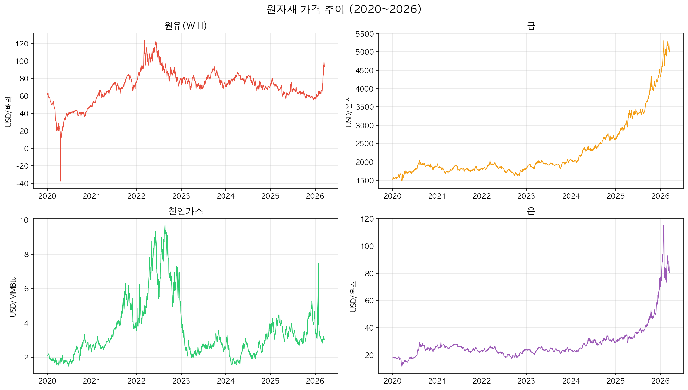
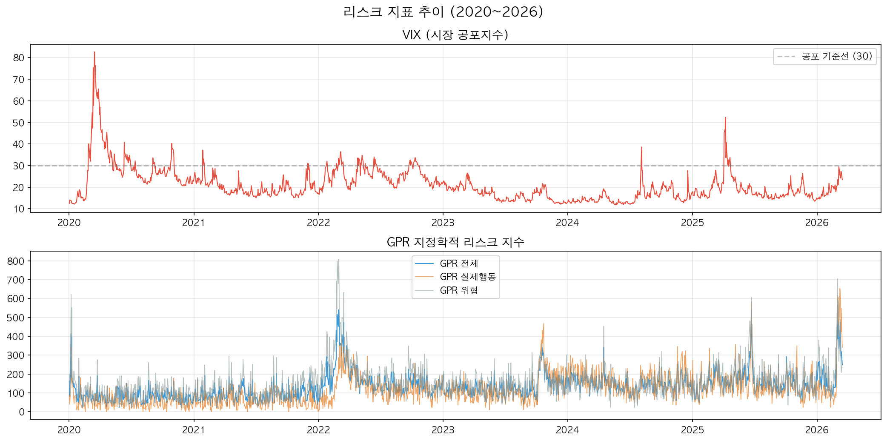
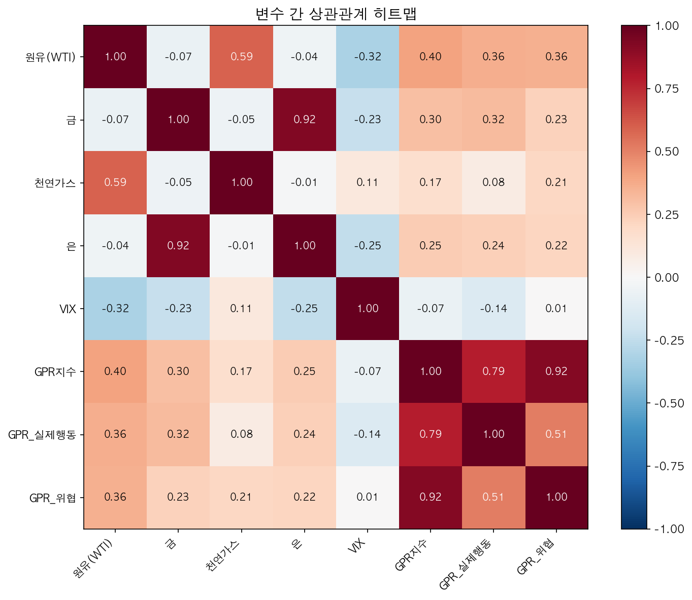
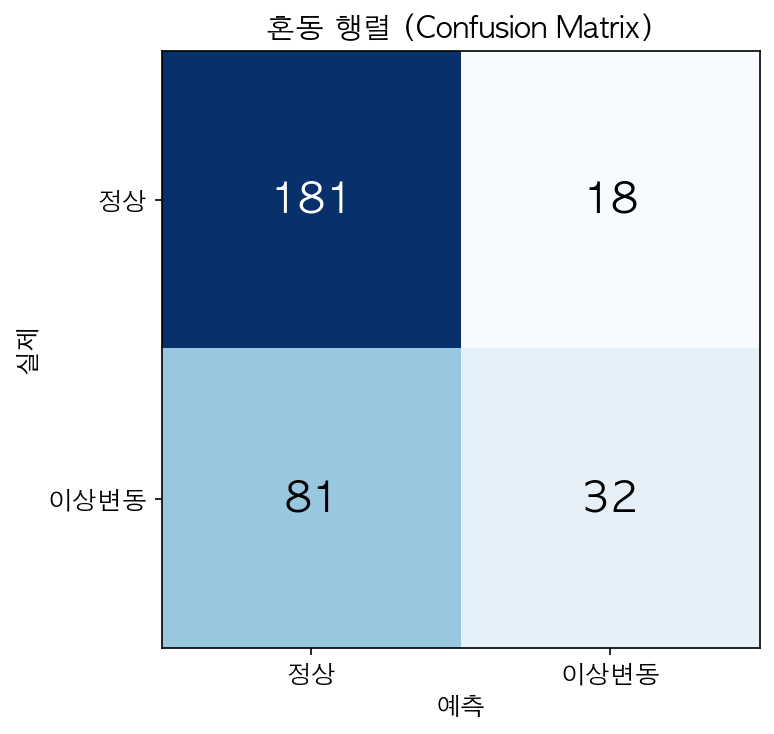
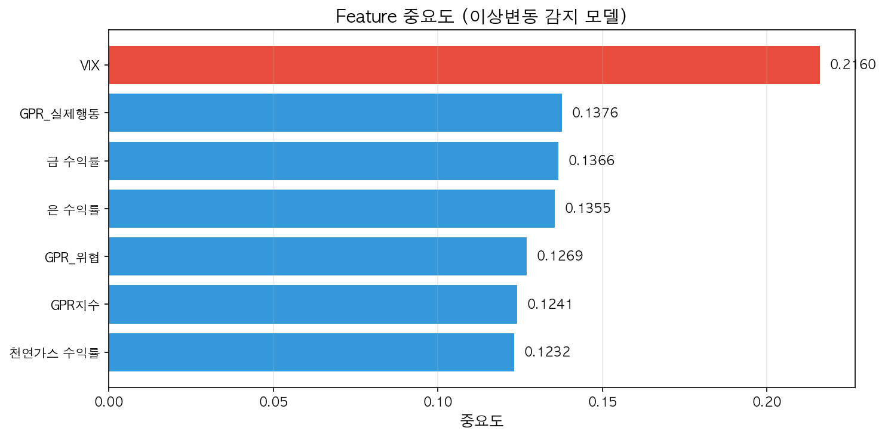

<!-- _class: lead -->
<!-- _paginate: false -->

# 지정학적 리스크를 반영한
# 원자재 이상 변동 감지 및 가격 예측

### 제출 1 - 초기 설계 & 1차 실행

**머신러닝 학기 프로젝트**
조장: 20232501 임태후 | 조원: 20232514 유종헌

2026년 3월

---

## 1. 문제 정의서

### 해결할 문제

- 국제 원자재 시장은 **지정학적 리스크**(전쟁, 군사적 긴장, 테러 등)에 민감하게 반응
- 2020년 코로나: 원유 가격 **-37달러**까지 폭락
- 2022년 러시아-우크라이나 전쟁: 원유, 천연가스 **급등**

> **목표:** 지정학적 리스크 지표(GPR Index, VIX)를 활용하여
> 원자재 가격의 이상 변동 감지 + 가격 방향 예측 ML 모델 개발

---

## 1-2 예측 목표

| 목표 | 유형 | 설명 |
|---|---|---|
| **이상 변동 감지** | 이진 분류 | 원유 일별 수익률 ±2% 이상을 이상변동으로 감지 |
| **가격 방향 예측** | 이진 분류 | 내일 원유 가격의 상승/하락 예측 |

&nbsp;

## 1-3 기대 효과

1. **투자 손실 최소화** — 지정학적 위기 시 가격 급락 사전 감지 → 포지션 정리
2. **매매 타이밍 최적화** — 리스크 지표 기반 매수/매도 신호로 수익률 제고
3. **리스크 경보 구독 서비스화** — 원자재 트레이더, 에너지 기업, 항공사 대상 실시간 경보
4. **원자재 의존 기업의 원가 관리** — 제조업·항공·물류 등 매입 시점 최적화

---

## 2. 데이터 설명

### 2-1 데이터 출처

| 데이터 | 출처 | 수집 방법 |
|---|---|---|
| 원자재 가격 | Yahoo Finance | yfinance 라이브러리 |
| VIX 지수 | CBOE (Yahoo Finance) | yfinance 라이브러리 |
| GPR Index | Caldara & Iacoviello (FRB) | 공개 엑셀 파일 |

### 2-2 데이터 크기

- **기간:** 2020-01-02 ~ 2026-03-16
- **행 수:** 1,558일 (거래일 기준) / **변수 수:** 8개

---

## 2-3 주요 변수

| 변수 | 설명 | 평균 | 최소 | 최대 |
|---|---|---|---|---|
| 원유(WTI) | 원유 선물 종가 (USD) | 69.91 | -37.63 | 123.70 |
| 금 | 금 선물 종가 (USD) | 2,283 | 1,477 | 5,318 |
| 천연가스 | 천연가스 선물 (USD) | 3.51 | 1.48 | 9.68 |
| 은 | 은 선물 종가 (USD) | 28.54 | 11.73 | 115.08 |
| VIX | 시장 공포지수 | 20.95 | 11.86 | 82.69 |
| GPR지수 | 지정학적 리스크 종합 | 134.44 | 22.26 | 564.93 |
| GPR 실제행동 | 실제 지정학적 사건 | 115.53 | 0.00 | 653.93 |
| GPR 위협 | 지정학적 위협 수준 | 156.74 | 21.69 | 809.49 |

---

## 2-4 원자재 가격 추이

---

## 2-5 리스크 지표 추이

---

## 2-6 변수 간 상관관계

---

## 2-7 주요 상관관계 해석

| 관계 | 상관계수 | 해석 |
|---|---|---|
| 금 — 은 | **+0.922** | 매우 강한 양의 관계 (같이 움직임) |
| 원유 — 천연가스 | **+0.589** | 보통 양의 관계 (에너지 자원) |
| GPR — 원유 | **+0.404** | 리스크 상승 시 원유 가격 상승 |
| VIX — 원유 | **-0.320** | 공포 상승 시 원유 가격 하락 |

> 일별 변동률 기준 상관관계는 대부분 **0에 가까움**
> → 당일 리스크 지표만으로는 즉각적 가격 변동 설명이 어려움

---

## 3. 기본 모델 실행

### 모델 A: 이상 변동 감지 (Random Forest)

**이상 변동 정의:** 원유 일별 수익률 절대값 ≥ 2%
- 전체 1,557일 중 **정상 1,004일(64.5%)**, **이상변동 553일(35.5%)**

| 항목 | 내용 |
|---|---|
| 알고리즘 | Random Forest Classifier |
| 나무 수 | 100 |
| 최대 깊이 | 10 |
| 학습 / 테스트 | 80% / 20% (Random Split) |
| Feature (7개) | VIX, GPR지수, GPR실제행동, GPR위협, 금/천연가스/은 수익률 |

---

## 3-2 이상 변동 감지 결과

| 성능 지표 | 값 | 설명 |
|---|---|---|
| **Accuracy** | 68.27% | 전체 중 맞춘 비율 |
| **Precision** | 64.00% | 이상변동 예측 중 실제 이상변동 비율 |
| **Recall** | 28.32% | 실제 이상변동 중 감지한 비율 |
| **F1-Score** | 39.26% | Precision과 Recall의 균형 점수 |

---

## 혼동 행렬 (Confusion Matrix)

- 정상 → 정상 (TN): **181건** / 정상 → 이상 (FP): **18건** [거짓 경보]
- 이상 → 정상 (FN): **81건** [놓친 이상변동] / 이상 → 이상 (TP): **32건** [성공적 감지]

---

## Feature 중요도

> **VIX(공포지수)**가 이상 변동 예측에 가장 중요한 변수

---

## 3-3 모델 B: 가격 방향 예측 & 매매 타이밍

| 항목 | 내용 |
|---|---|
| 방향 예측 모델 | Random Forest Classifier (n=200, depth=10) |
| 수익률 예측 모델 | Random Forest Regressor (n=200, depth=10) |
| 데이터 분할 | 시간순 80% / 20% 분할 |
| 매수 조건 | 방향=상승 AND 예측 수익률 > 0.3% |
| 매도 조건 | 방향=하락 AND 예측 수익률 < -0.3% |

---

## 모델 B 결과

| 지표 | 값 |
|---|---|
| 방향 예측 정확도 | **47.4%** |
| 매수 신호 횟수 / 적중률 | 9회 / **33.3%** |
| 매도 신호 횟수 / 적중률 | 14회 / **71.4%** |

### 투자 시뮬레이션 (100만원 기준)

| 전략 | 최종 자산 | 수익률 |
|---|---|---|
| 그냥 보유 (Buy & Hold) | 1,335,333원 | **+33.5%** |
| 모델 신호 매수 | 904,128원 | **-9.6%** |

> 매수 신호는 부적합하나, **매도 신호(71.4%)는 하락 회피에 부분적 유용**

---

## 4. 성능 지표 해석

### 모델 A — 이상 변동 감지

- **Accuracy 68.3%**: "모두 정상" 예측만으로도 64.5% → 실질 기여 제한적
- **Precision 64.0%**: 거짓 경보율 36%
- **Recall 28.3%**: 실제 이상변동 113건 중 **32건만 감지** (72% 놓침)
- **F1-Score 39.3%**: Precision/Recall 불균형

### 모델 B — 가격 방향 예측

- **방향 정확도 47.4%**: 동전 던지기(50%)보다 낮음
- **매수 적중률 33.3%**: 매수 타이밍 포착 실패
- **매도 적중률 71.4%**: 위험 회피 관점에서 부분적 활용 가능

---

## 4-3 종합 평가

> 현재 모델은 **"위험 경보"** 용도로는 부분적으로 작동하나,
> **"매수 타이밍 추천"** 용도로는 부적합하다.

1주차 기본 모델의 한계를 명확히 보여주는 결과이며,
이후 단계에서 개선이 필요하다.

---

## 5. 현재 한계

| # | 한계점 | 상세 설명 |
|---|---|---|
| 1 | 시차(Lag) 미반영 | 오늘의 GPR/VIX만 사용, 며칠 전 리스크 변화 미반영 |
| 2 | 이상변동 기준 단순 | ±2% 고정 임계값, 변동성 큰 시기엔 부적합 |
| 3 | 시간 순서 무시 | Random Split 사용, 시계열 분할이 더 적절 |
| 4 | 원유만 대상 | 금, 천연가스, 은 개별 모델 미구축 |
| 5 | Feature 부족 | 이동평균, 거래량, 기술적 추세 지표 미포함 |
| 6 | Recall 부족 | 실제 이상변동의 72%를 놓치고 있음 |

---

## 5-2 개선 방향

- 여러 모델 비교 (Logistic Regression, SVM, **XGBoost**, KNN)
- **시계열 분할** (TimeSeriesSplit) 적용
- **시차 Feature** 추가 (전일/전주 GPR, VIX 변화량)
- 이동평균, 볼린저밴드 등 **기술적 지표** 추가
- **하이퍼파라미터 튜닝** (GridSearch / RandomSearch)
- **Class Imbalance** 처리 (SMOTE, class_weight 조정)
- 4개 원자재 **통합 예측 시스템**으로 확장
- 실시간 투자 경보 시스템 적용 가능성 분석
- API를 이용한 **데이터 자동 수집** 및 실시간 처리 파이프라인 구축

---

<!-- _class: lead -->

# 감사합니다

**부록: 사용 도구 및 환경**

| 항목 | 내용 |
|---|---|
| 언어 | Python 3.9 |
| 환경 | Google Colab |
| 데이터 수집 | yfinance, pandas |
| 머신러닝 | scikit-learn (RandomForest) |
| 시각화 | matplotlib |
