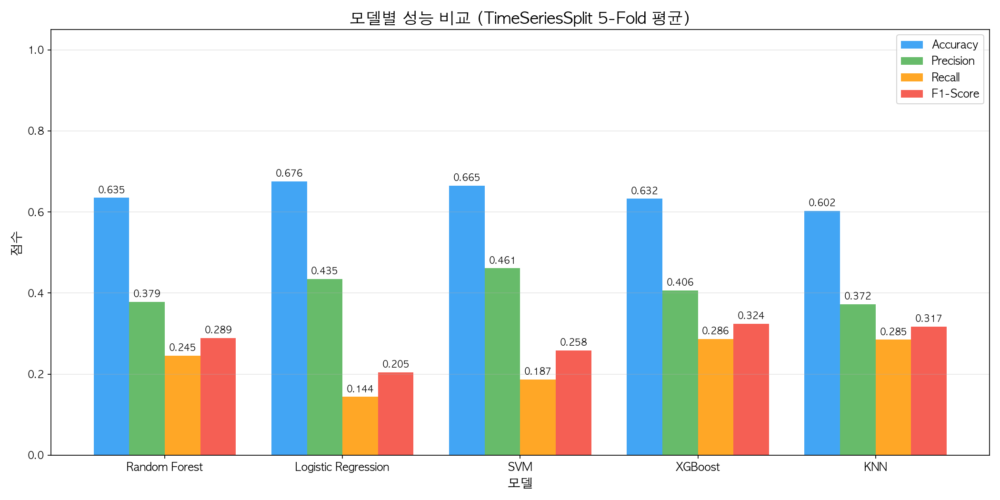
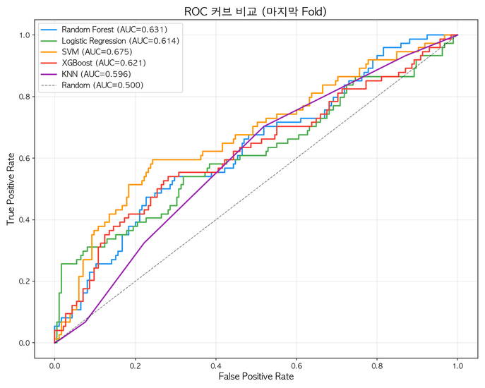
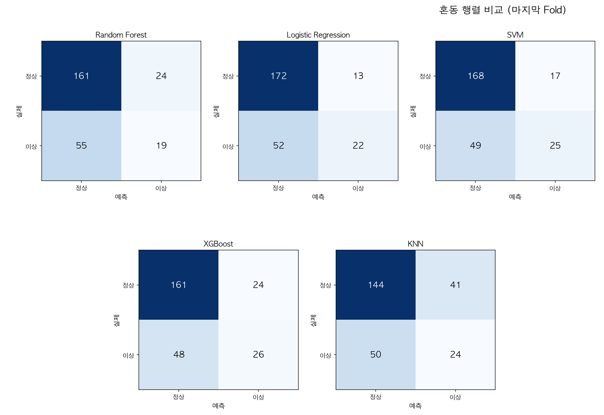
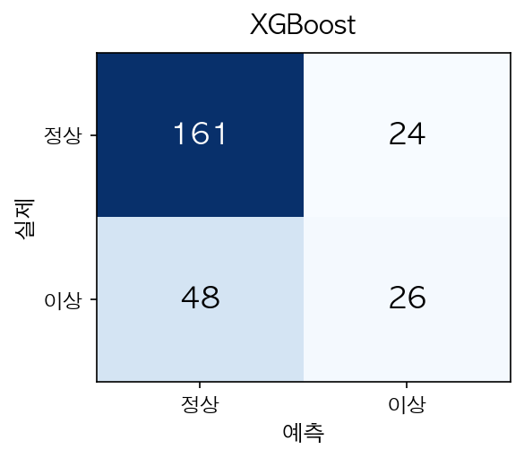
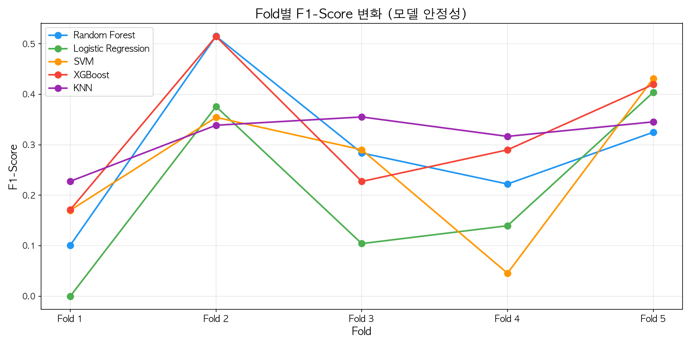

# 지정학적 리스크 기반 원자재 이상변동 감지

### 중간평가 시연

**조원:** 20232501 임태후(조장) · 20232514 유종헌

---

## 1. 프로젝트 소개

**목표:** 원유(WTI) 가격의 이상 변동(±2% 이상)을 사전 감지

**활용 데이터:**
- 기간: 2020.01 ~ 2026.03 (약 1,558일)
- Feature 7개: VIX, GPR지수, GPR_실제행동, GPR_위협, 금/천연가스/은 수익률
- Target: 원유 일간 수익률 ±2% 이상 → 이상변동(1), 미만 → 정상(0)

**클래스 분포:**
| 구분 | 비율 |
|------|------|
| 정상 (\|수익률\| < 2%) | 64.5% |
| 이상 (\|수익률\| ≥ 2%) | 35.5% |

---

## 2. 1주차 결과 & 한계

→ Recall 28.3%: 이상변동의 72%를 놓침

---

## 3. 1주차 → 2주차 개선

| 항목 | 1주차 | 2주차 |
|------|-------|-------|
| 모델 | Random Forest 1개 | 5개 모델 비교 |
| 검증 방식 | Random Split | TimeSeriesSplit 5-Fold |
| 정규화 | 미적용 | StandardScaler 적용 |
| 문제점 | 미래 데이터 유출 (Data Leakage) | 시간 순서 보장 |

---

## 4. 2주차 모델 비교 (5개 모델 × 5-Fold)

**비교 모델:** Random Forest, Logistic Regression, SVM(RBF), XGBoost, KNN

| 모델 | Accuracy | Precision | Recall | F1-Score |
|------|----------|-----------|--------|----------|
| Random Forest | 0.611 | 0.373 | 0.224 | 0.261 |
| Logistic Regression | 0.558 | 0.340 | 0.260 | 0.277 |
| SVM (RBF) | 0.631 | 0.385 | 0.207 | 0.254 |
| **XGBoost** | **0.590** | **0.365** | **0.286** | **0.324** |
| KNN | 0.575 | 0.335 | 0.179 | 0.218 |

→ **XGBoost가 F1-Score, Recall 모두 1위**

---

## 5. 모델별 성능 비교 차트

---

## 6. ROC 커브 비교

---

## 7. 혼동행렬 비교

---

## 7-1. XGBoost 혼동행렬

<table style="border: none;"><tr>
<td style="border: none;"></td>
<td style="border: none; vertical-align: middle; padding-left: 20px; font-size: 19px;">

|  | 예측: 정상 | 예측: 이상 |
|--|-----------|-----------|
| **실제: 정상** | TN 161 (정상→정상) | FP 24 (오경보) |
| **실제: 이상** | FN 48 (놓침) | TP 26 (감지성공) |

**핵심:** FN(놓침)이 FP(오경보)보다 **더 치명적**

→ Recall = 26/(26+48) = **35.1%**

</td></tr></table>

---

## 8. Fold별 F1-Score 변화

→ XGBoost가 Fold 전반에 걸쳐 가장 안정적인 F1-Score

---

## 9. XGBoost 선정 이유

**① 분류 성능 최고**
- F1-Score(0.324), Recall(0.286) 모두 1위
- 이상변동 감지에 가장 적합

**② 부스팅 방식의 강점**
- 이전 트리가 놓친 이상변동에 집중 → Recall 개선에 유리

**③ 클래스 불균형 처리 내장**
- `scale_pos_weight`로 소수 클래스(이상변동) 가중치 부여

**④ 분류 + 회귀 통합 가능**
- XGBClassifier → 이상변동 감지
- XGBRegressor → 수익률 예측

---

## 10. 현재 한계

**① Recall 부족 (28.6%)**
- 이상변동의 약 71%를 여전히 놓침
- 클래스 불균형 (정상 64.5% vs 이상 35.5%)

**② 회귀 성능 한계 (R² 음수)**
- 현재 Feature만으로는 수익률 예측이 불충분
- SVR이 회귀 1위이나, 모든 모델 R²가 음수

**③ Feature 부족**
- 당일 데이터만 사용, 시차(lag) 정보 없음

**④ 하이퍼파라미터 미튜닝**
- 기본값으로만 학습

---

## 11. 3주차 개선 계획

| 개선 항목 | 방법 |
|-----------|------|
| Recall 개선 | SMOTE 오버샘플링, class_weight 조정 |
| Feature 추가 | 이동평균, RSI, 볼린저밴드, 전일 VIX 변화율 |
| 시차 Feature | 1~5일 전 데이터를 Feature로 추가 |
| 하이퍼파라미터 | GridSearch / RandomizedSearch 최적화 |
| 투트랙 서비스 설계 | 위험 경보(Recall↑) + 매수 타이밍(Precision↑) |
